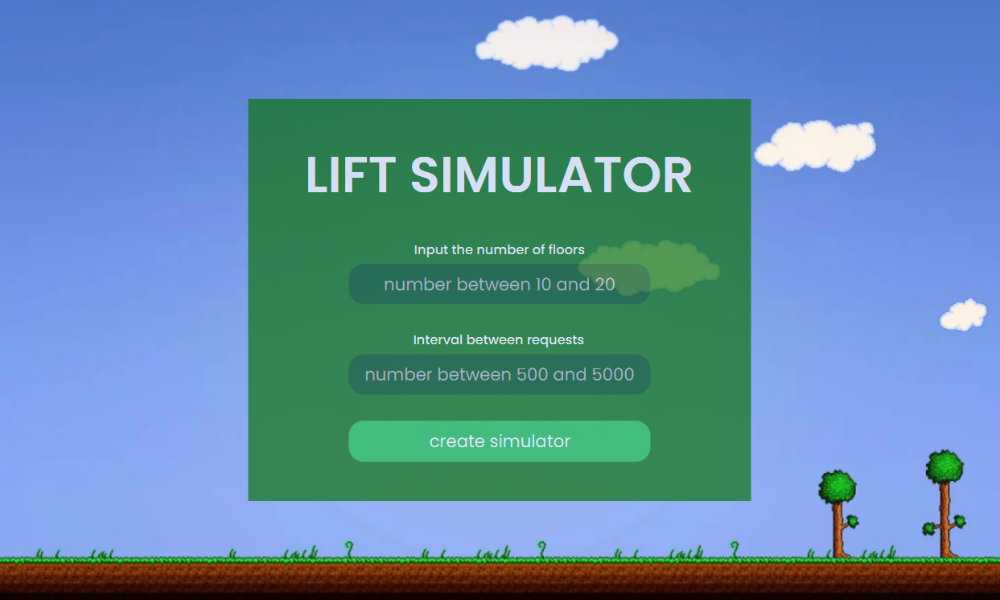
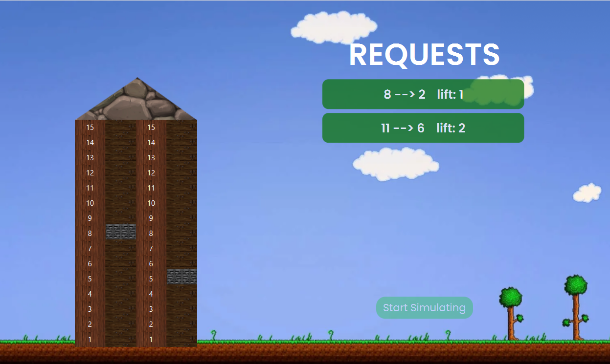

# Симулятор движения лифтов с графическим интенфейсом

Программа оптимального управления лифтами. 

Есть жилой дом с большим количеством этажей (15-20), в нем есть 2 лифта. Генерируется постоянный поток "заявок", т.е. людей, вызывающих лифт на разных этажах. 

Параметры генерации (интервал, кол-во) можно настраивать. Для каждой заявки известен номер этажа, на котором она поступила и направление движения (вверх или вниз). Лифты управляются таким образом, чтобы минимизировать время ожидания человеком лифта после вызова и также минимизировать суммарный "пробег". Лифт может останавливаться по "попутным" вызовам.

### При создании приложения:
- использовался шаблон проектирования архитектуры приложения Model-View-ViewModel
- javaFX - платформа на основе Java для создания приложений с насыщенным графическим интерфейсом.
- CSS - для создания стилей